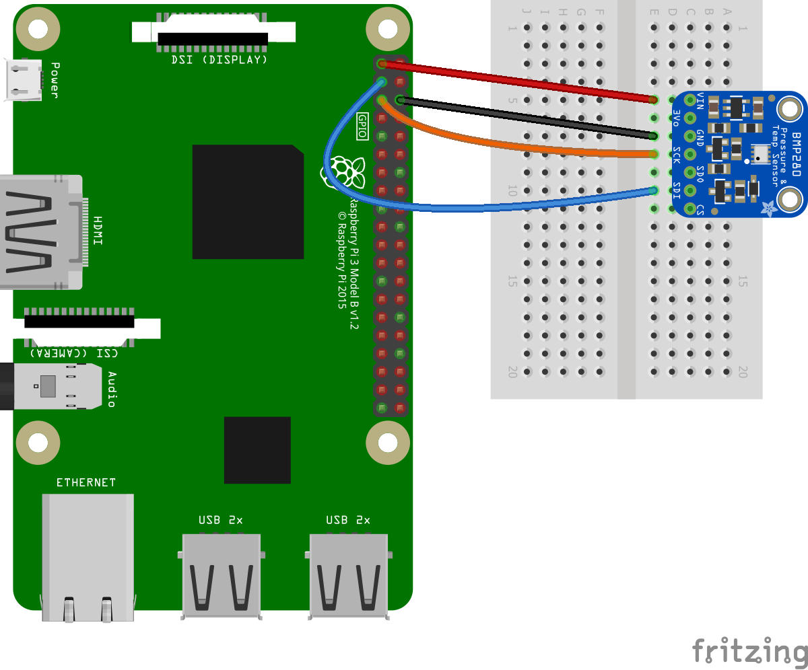

# Using BMP280 

[Datasheet](https://cdn-shop.adafruit.com/datasheets/BST-BMP280-DS001-11.pdf) for the BMP280.

An example on how to use this implementation is available in [samples](samples).

The following fritzing diagram illustrates one way to wire up the BMP280 with a Raspberry Pi using I2C.

